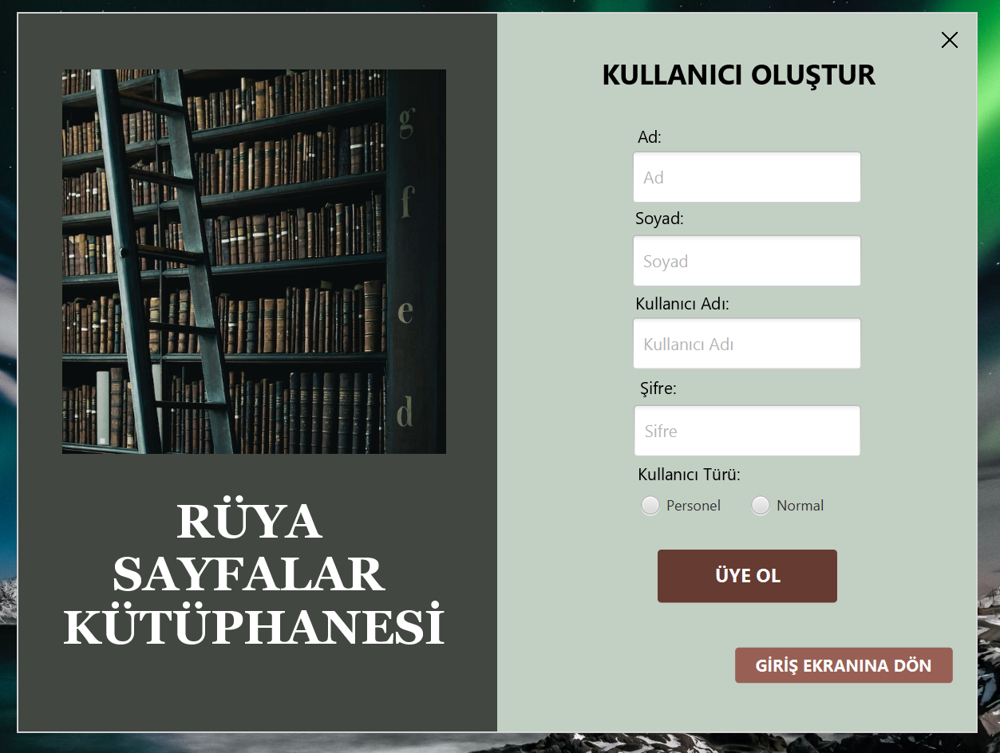
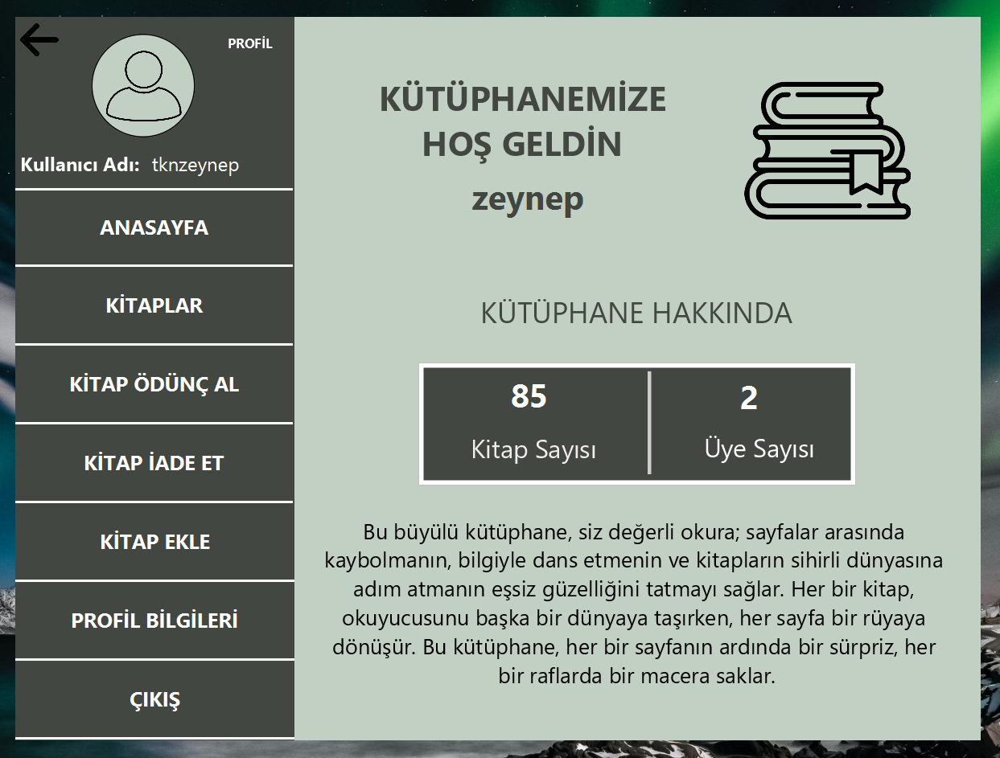
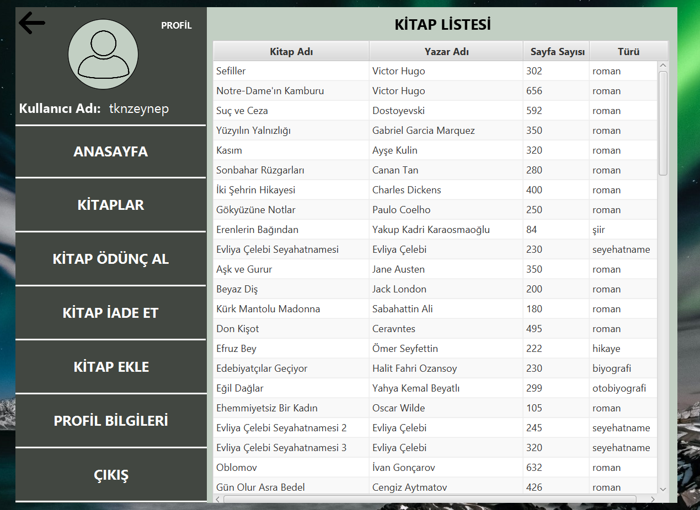
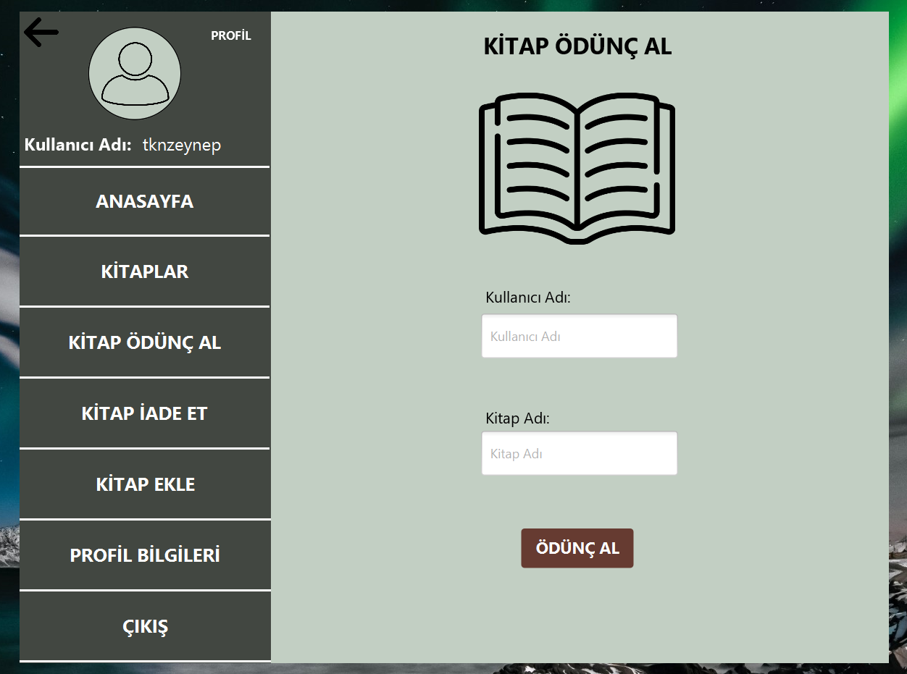
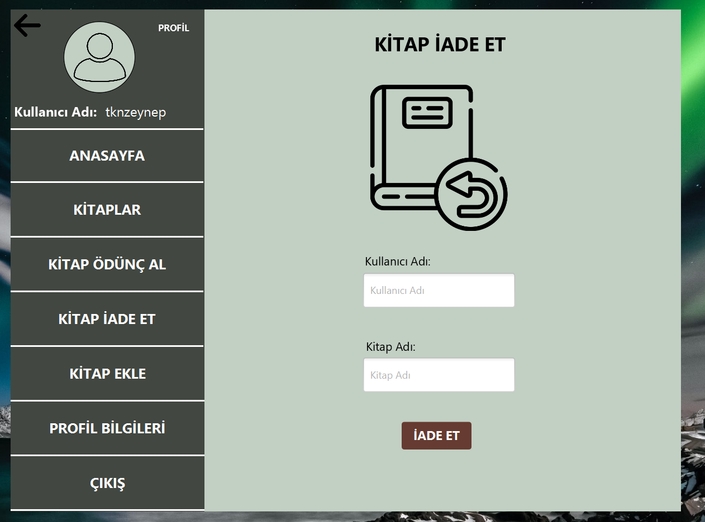
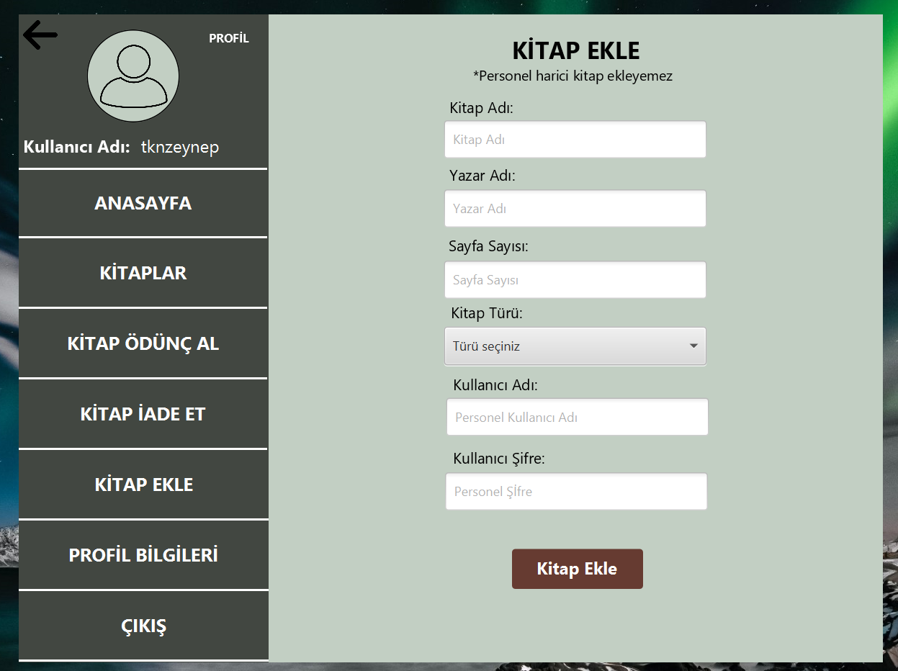
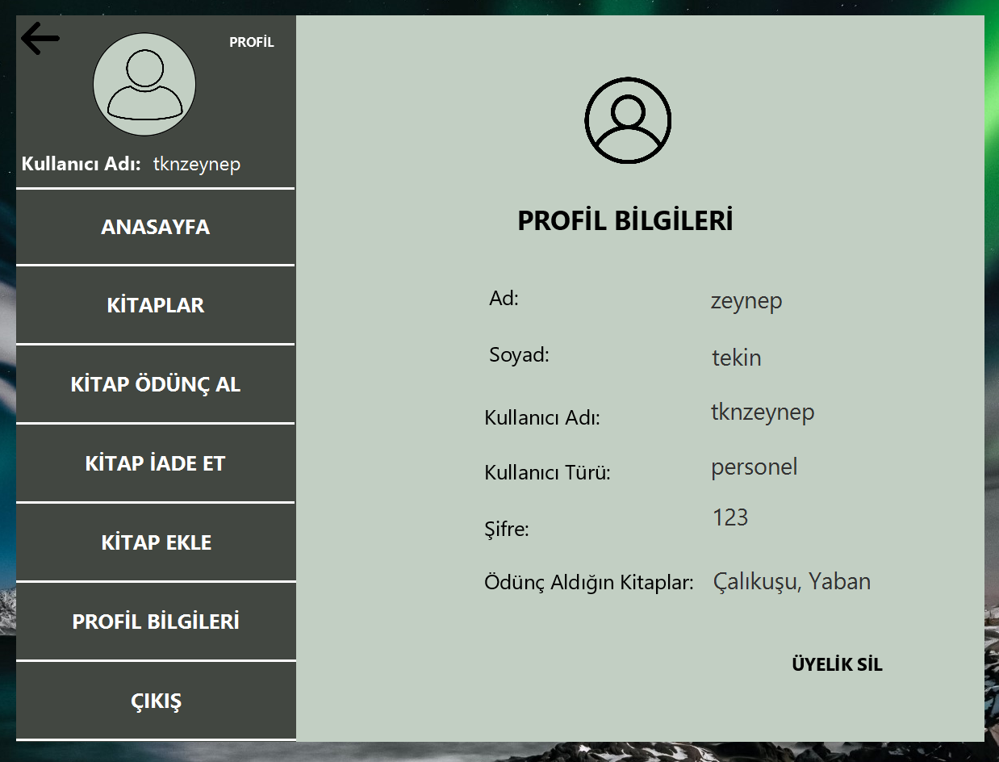
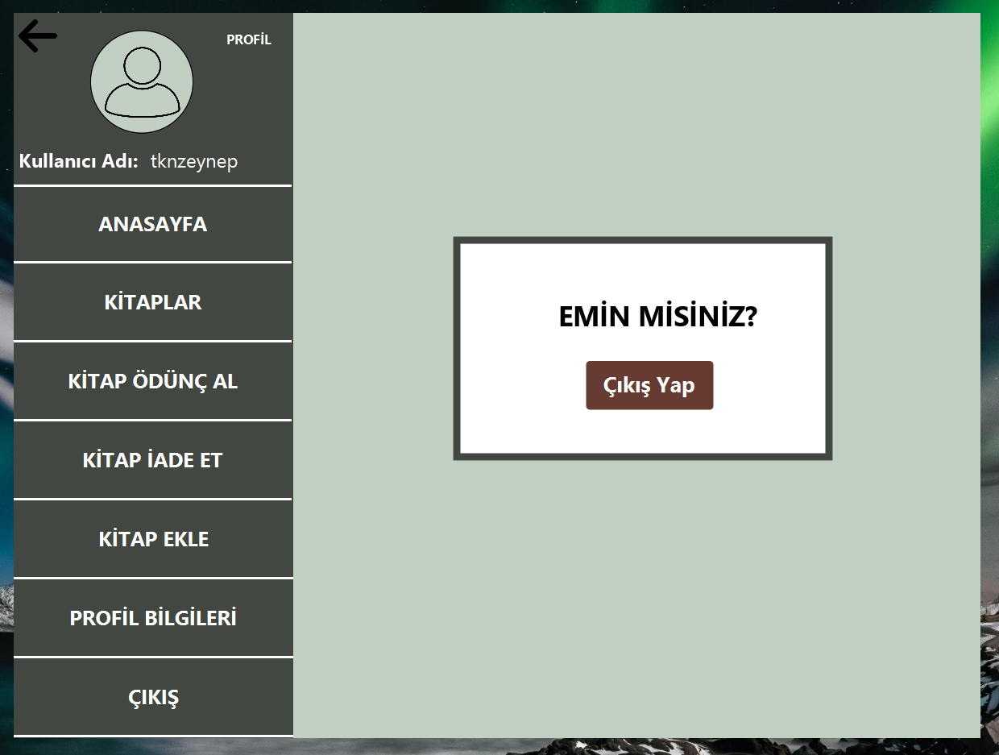

# KutuphaneOtomasyonu
## Java-Kütüphane Otomasyonu
### Kullanılan-Teknolojiler:

Eclipse-Java ile geliştirilmiştir. Arayüz JavaFX ile geliştirilmiştir. MVC mimari deseni kullanılmıştır. Veritabanı için metin dosyaları oluşturarak veri onlara aktarılmıştır.

Kütüphane Otomasyonu İçinden Görüntüler:

1)Üye girişi 

2)Üye Ol(personel-normal)

Projenin Diğer Menüleri 

1)Anasayfa 

2)Kitaplar

3)Kitap Ödünç Al 

4)Kitap İade Et

5)Kitap Ekle

6)Profil Bilgileri

7)Çıkış Yap

